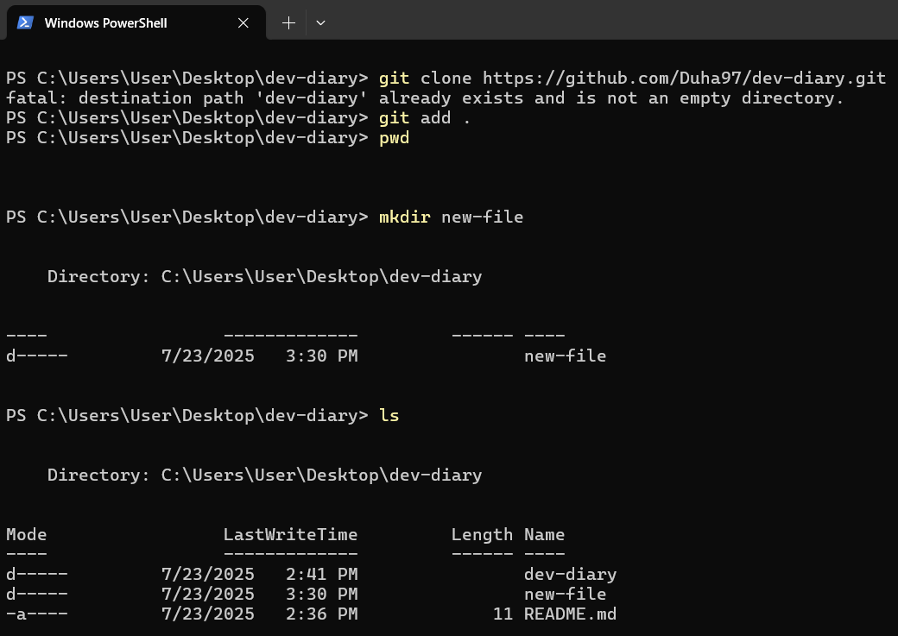

# dev-diary

Hello, my name is **Duha** and I am a new *software engineer*, I studied computer science at _AABU_ and worked in customer support field for 3 years.
Right now I am a student in LTUC and I'm learning javascript to become a full stack developer.

## Here is what I learned from the good developer mindset sheet

 1. A successful developer must adopt a lifelong learning mindset to keep up with evolving technologies.

 2. Large problems should be broken into smaller, manageable tasks for better clarity and progress.

 3. Debugging requires critical thinking and detective-like investigation, not assumptions.

 4. A growth mindset helps you overcome challenges and view failure as a learning opportunity.

 5. Code should always focus on delivering value to users, not just elegance or complexity.

 6. Simplicity and maintainability in design and implementation are key to long-term success.

 7. Developers must make smart trade-offs and prioritize tasks based on importance and urgency.

 8. Plan for future maintenance and extensibility, not just short-term functionality.

 9. Embrace iterative development and continuous user feedback over perfect planning.

 10. Automate repetitive tasks and avoid perfectionism good enough shipped is better than perfect never released.

     #### Examples of tasks ripe for automaion:

        - Running tests
        - Generating code boilerplate
        - Deploying code to services
        - Creating new development environments
        - Updating dependencies
        - Reformatting code

## Here is what I learned from terminal commands sheet 

I learned the commands in the picture attached below:

